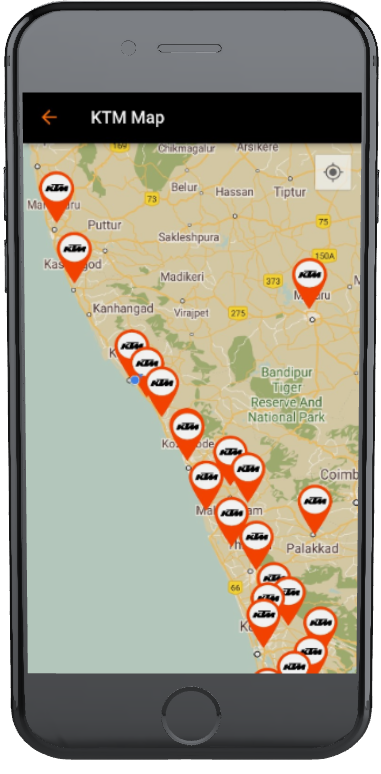
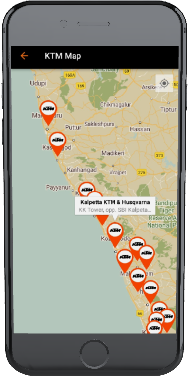
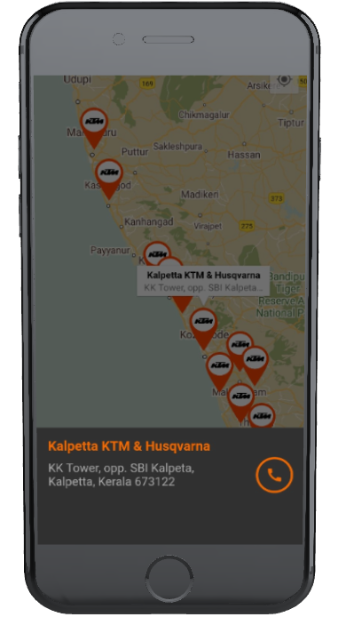

# New Bike Selling App (KTM Official App clone)
A clone application of official KTM app developed using Flutter for front-end and PHP for back-end. The application uses google maps to locate nearest KTM showrooms, this helped me to work on with different flutter dependency. 
<br><br>



>The application is developed for educational purpose only.

## 🔗 API Information
The database, API and all other back-end fucntions are created by me only for the sole purpose of this app and not hosted anywhere. Therefore the datas coming from API wont work on other machines until a fake database is created and hosted.  

## 🎯 What this application intended to offer
- Book bikes, bike services, & test-ride
- Easily accessible showroom details with the help of google maps
- Join the KTM rider's community
- Complete details about each and every bike KTM offers
- Attractive and user friendly ui design

## 📱 Screenshots


## 💻 Test application on your machine
Open CMD from where you want to clone the project & run the following commands:
```
  git clone https://github.com/x-abgth/new-bike-selling.git
```
```
  cd new-bike-selling
 ```
 ```
  flutter packages get
 ```
 ```
  flutter run
```
## ❤ Conclusion
🌟 Star this repo & follow for more 😊
